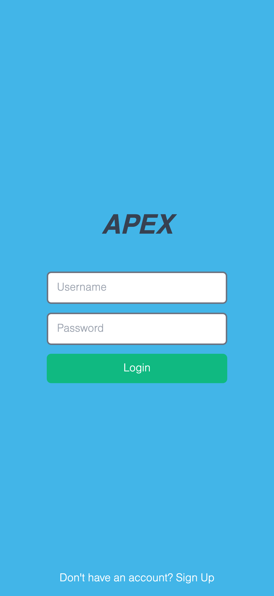
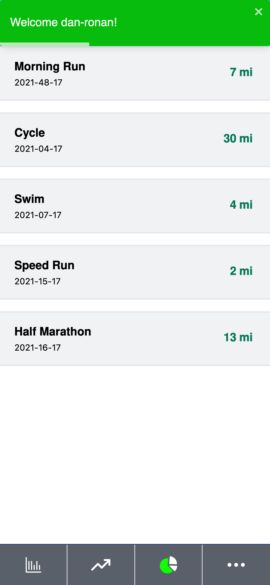
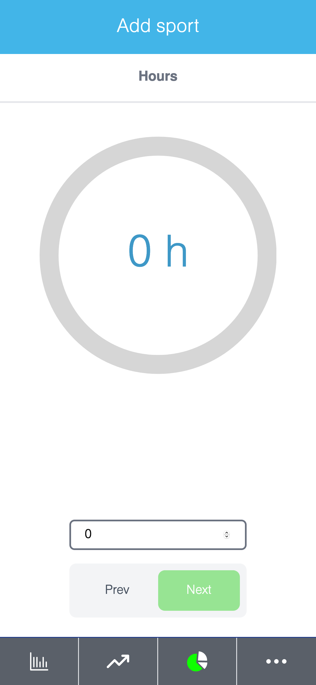

# APEX ⚽ : Frontend

[Click here for the API](https://github.com/DcRonan/apex-api)


## Library Directory 📙

| Contents                  |
| ------------------------- |
| [Built With](#built-with) |
| [Live Demo](#live-demo)   |
| [Install](#install)   |
| [Testing](#testing)   |
| [Authors](#authors)       |
| [License](#license)       |

## Description

> I have built an app that lets you track your sports & fitness workouts that uses a Rails API that I built.

<style>
.images {width: 200px}
</style>





You have options to create a user account with a username and password, create a sport with multiple options and progress to track all your data etc.

## Built With 🛠

```
- Ruby on Rails
- React.js
- Rails API
- Ruby
- JavaScript
- PostgreSQL
- Redux
- Tailwind CSS
- Heroku
- VS Code
```


## Live Demo 🎥

<a href="https://app.netlify.com/start/repos">Live Demo</a>

## Install ⏳

> Follow these steps below to get my Application working. I used [npm](https://www.npmjs.com/) to manage all my packages for React. If you don't have it installed already, you can install it [here](https://www.npmjs.com/get-npm)

1. - [ ] Open your `Terminal`
2. - [ ] Navigate to the directory where you will like to install the repo by running `cd apex`
3. - [ ] Run `git clone git@github.com:DcRonan/apex.git` to download <b>or</b> you can download using `HTTPS` by running `git clone https://github.com/DcRonan/apex.git` in the terminal
4. - [ ] Run `cd apex` to enter the directory
5. - [ ] Run `npm i` to install all the packages
6. - [ ] Run `npm start` to start the app
7. - [ ] Your preferred `browser` will open


## Testing ⚙

> I have used linters to test my code, which includes: [jest](https://jestjs.io/) and [react testing library](https://testing-library.com/docs/react-testing-library/intro/)

1. - [ ] Open `Terminal` again
2. - [ ] Run `cd apex` to enter the directory
3. - [ ] Run `npm test` to start testing
4. - [ ] All tests will pass ✅


## Authors

### 👨‍💻 Daniel Ronan

[](https://github.com/DcRonan) <br>
[](https://www.linkedin.com/in/dan-ronan/) <br>
[](mailto:danielconnorronan@gmail.com) <br>
[](https://twitter.com/dc_ronan)

### Acknowledgements ⭐

Design by [Gregoire Vella](https://www.behance.net/gallery/13271423/Bodytrackit-An-iOs-app-Branding-UX-and-UI)

### 🤝 Contributing

Contributions, issues and feature requests are welcome!

Feel free to check the [issues page](https://github.com/DcRonan/apex/issues).

### Show your support

Give a ⭐️ if you like this project!

### License

